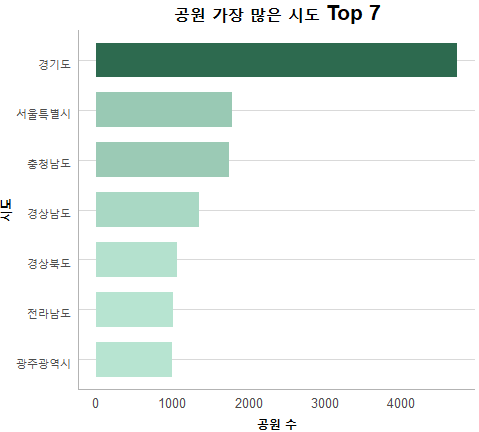
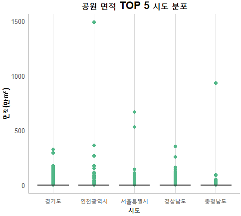
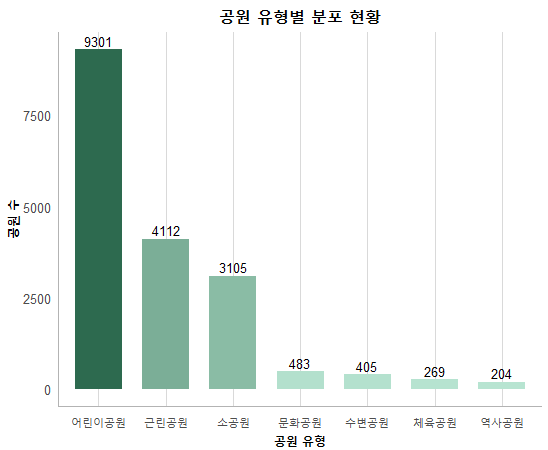
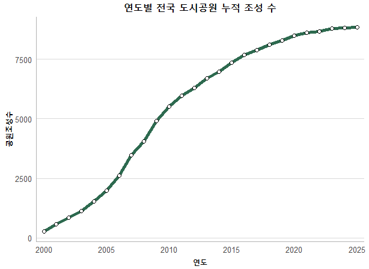
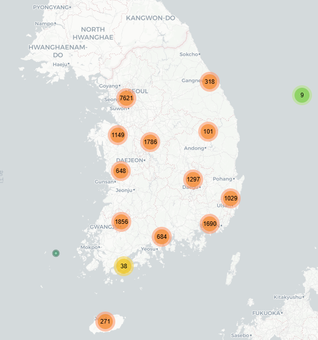
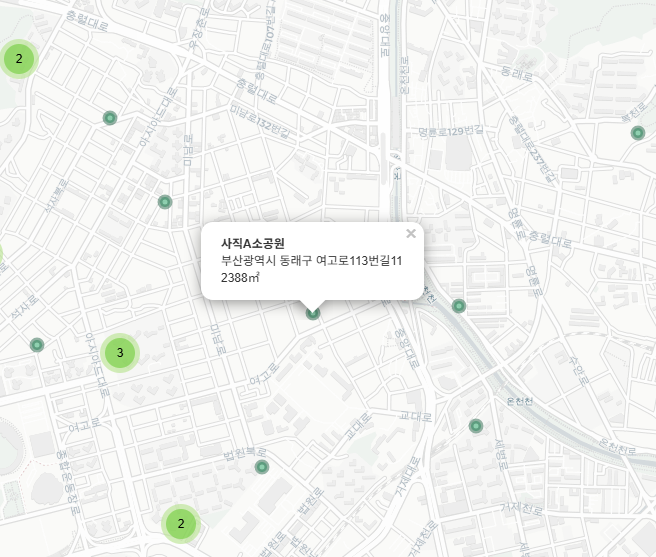

# 🌳 전국 도시공원 분석 프로젝트

## < 프로젝트 소개 >

공공데이터포털의 **전국도시공원정보표준데이터**를 활용하여 2001년부터 2025년까지 전국 도시공원의 현황을 분석하고 시각화한 프로젝트입니다.

지역별 공원 수, 공원 면적, 공원 유형, 연도별 조성 추이 등을 분석하고 지도 시각화를 통해 전국 도시공원의 위치와 분포를 직관적으로 확인할 수 있도록 구현했습니다.

---

## 프로젝트 목적

- 공공데이터를 활용한 전국 도시공원 현황 분석
- 시도별·공원 유형별·연도별 특성 비교
- 지역별 공원 수 및 면적 차이 분석
- 다양한 그래프와 지도 기반 시각화

---

## 사용 기술

| 구분 | 사용 기술 |
|---|---|
| 운영체제 | Windows 11 |
| 개발도구 | R, RStudio |
| 프로그래밍 언어 | R |
| 주요 패키지 | ggplot2, dplyr, leaflet, htmltool |

---

## 데이터 소개

### 데이터 출처

- 공공데이터포털(data.go.kr)
- 전국도시공원정보표준데이터(CSV)

### 데이터 규모

- 데이터 수 : 약 18,499건
- 컬럼 수 : 19개

### 주요 데이터

| 구분 | 주요 항목 |
|---|---|
| 공원 정보 | 공원명, 공원구분 |
| 위치 정보 | 소재지도로명주소, 소재지지번주소, 위도, 경도 |
| 관리 정보 | 지정고시일 |

---

## 데이터 전처리

- 주요 컬럼 결측값 확인 및 처리
- 도로명주소·지번주소 결측값 상호 보완
- 주소 오타 및 지역명 정제
- 지정고시일 `Date` 형식 변환
- 공원면적 수치형 변환
- 시설 정보 결측값 `"없음"` 처리

---

## 데이터 분석 및 시각화

### 1. 시도별 공원 개수

- 경기도의 공원 수가 전국에서 가장 많음
- 서울특별시와 충청남도도 비교적 높은 수준

### 2. 시도별 평균 공원 면적

.png)

- 인천광역시의 평균 공원 면적이 가장 높음
- 일부 대규모 공원이 지역 평균에 영향을 미침

### 3. 공원 면적 분포

- 대부분 소규모 공원이 분포하며, 일부 초대형 공원이 존재
- 지역별로 공원 면적의 분포와 규모에 차이가 나타남

---

### 4. 공원 유형별 분포

- 어린이공원이 가장 많은 비중을 차지
- 근린공원과 소공원이 그 뒤를 이어 높은 비중을 보임

---

### 5. 연도별 공원 조성 추이

- 2001~2010년 공원 조성이 활발하게 이루어짐
- 이후에는 공원 조성 증가세가 점차 완만해지는 경향을 보임

---

### 6. 지도 시각화

`leaflet`을 활용하여 전국 도시공원의 위치를 시각화했습니다.

- 전국 도시공원의 위치와 지역별 분포를 지도에서 확인
- 확대 시 공원명, 위치, 면적 등 세부 정보를 확인
